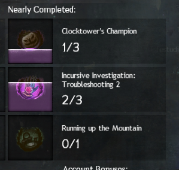

# GW2-TrendyAchievementSuggestions
Public part of Guild Wars 2 addon: Trendy Achievements Suggestions

### Preview

### Functionality
Trendy Achievements Suggestion addon substitutes game's default "Nearly Complete" achievements recommendation's with the topmost unlocked by playerbase according to [GW2 Efficiency](https://gw2efficiency.com/). Configuration allows to exclude achievements explicitly, specify handling of seasonal, repeatable and character adventure guide.

### Planned features
1. Dynamic checks for active special events
2. Hide dropdown selection for type of recommendations - disfunctional when addon is active
3. Dynamic checks for Character Adventure Guide type achievements
